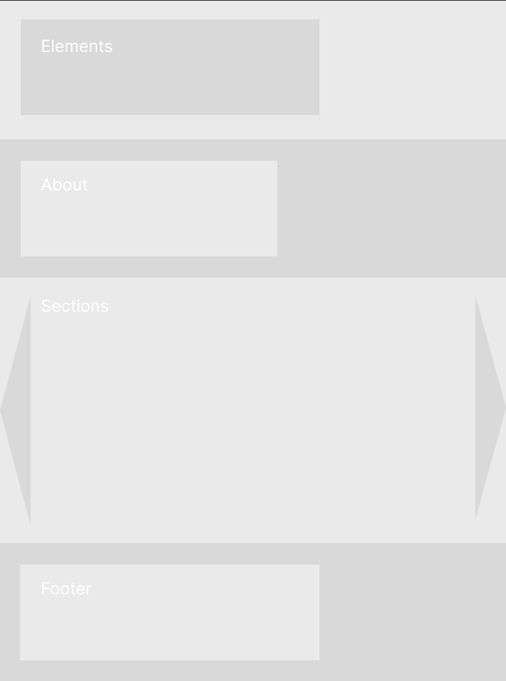

# About Project 
In this project, I wanted to recreate the GSAP library approach and build a less bloated project than I did in the past.
The main idea is to use GSAP because it provides an imperative approach to creating animations, which gives more direct control over motion and timing.
The animations should feel more physics-oriented, creating a sense of real interaction during page scrolling or dragging. The goal is to make the movement feel responsive and natural, as if objects have weight, momentum, or resistance.

## Project Ideas/Preparation

1. **Draggable Micro Elements Interactions**
Small interactive elements that user can drag. Movement should feel physical with inertia, resistrance, and smooth settling. like objects with weight.
2. **Horizontal Scroll Section**
A section of the page where vertical scrolling drives horizontal movement. Elements inside this section animate based on scroll progress, creating a sense of spatial navigation.
3. **Animated Text**
Text elements that animate into view, or interations.

For the Draggable Micro Elements Interactions I got inspired by https://codepen.io/shunyadezain/pen/qBzJzQg 

## Plan 

| Date              | Estimated Task               | Expected Result                                           | Actual Result                                                     |
|-------------------|-----------------------------|-----------------------------------------------------------|-------------------------------------------------------------------|
| 10.02–11.02       | Design and Setup            | A solid design idea and project structure                | Overall Bauhaus design allowing a uniform space for animations   |
| 13.02–16.02       | Working Showcase            | Well-rendered website with good usability                | Yes                                                               |
| 17.02–18.02       | Refactoring and Rethinking  | Code improvements and structural adjustments             | Some additions implemented                                        |
